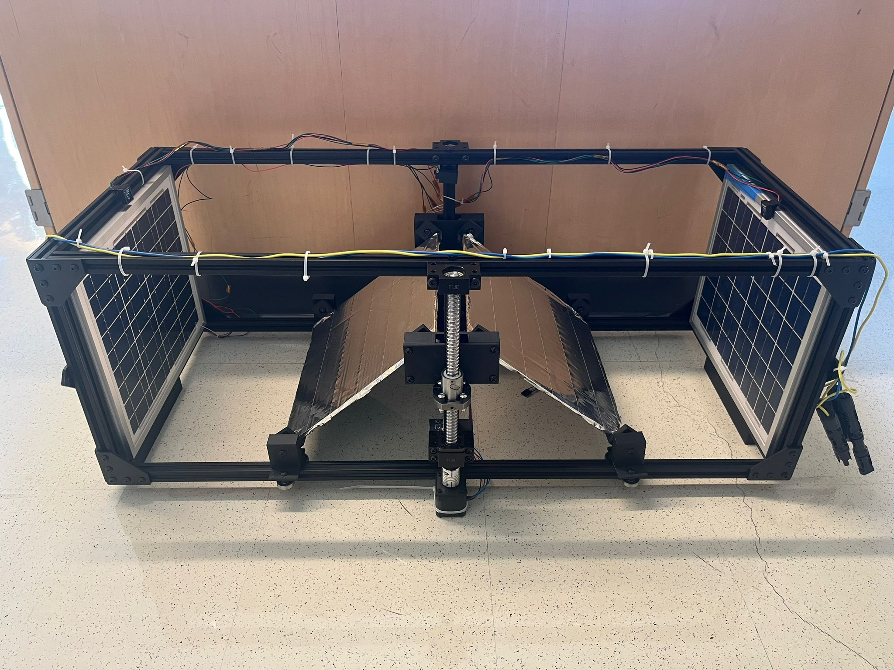
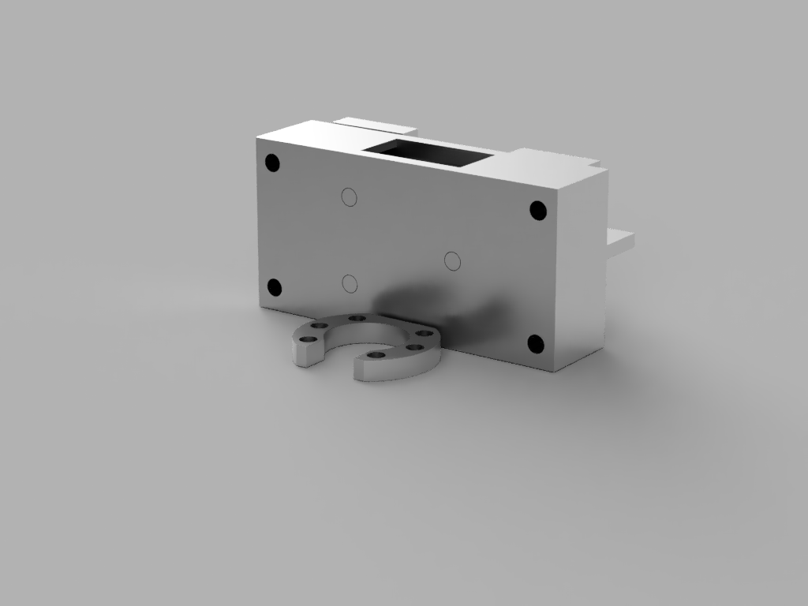
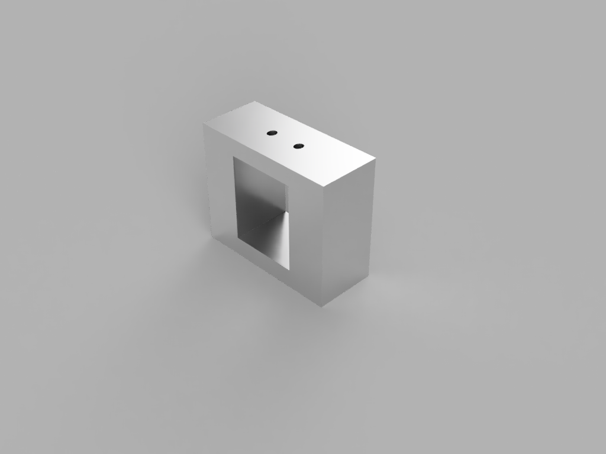
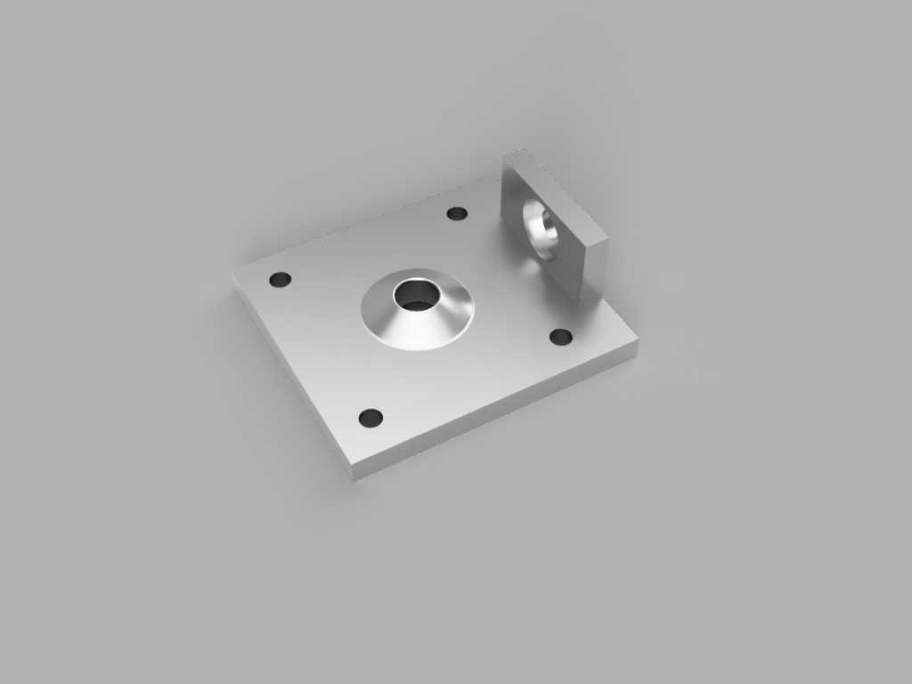

#Hardware Documentation
##Overview
The hardware in SOL is segmented into two parts :
1. Structure & Housing
2. Electronics

The Structure & Housing consists of the solar-panels, the reflector system (mentioned in more detail below), the aluminum-gantry for mounting, and the various housings that contain the electronics & battery. 

The Electronics consist of the sensors, microcontrollers, motor driver, the Solar Charge Controller, and the PCB's that connect them. These monitor the structure, log data, then control the system based on the feedback received from the sensors.

##Structure & Housing

Above is the structure, which consists of the reflector system, the solar-panels, and the aluminum-gantry. 

###Aluminum Gantry
These are standard aluminum extrusions that can be purchased from various retailers. The original rods were 40in in length, and were machined down to an appropriate size. The size of the structure was determined by the size of the panels, and was designed such that the reflectors have enough room to cover their entire range of motion. More on this is detailed in the reflector system below. The structure is held together via aluminum brackets & screw joints.

###Solar Panels
The panels used in our design serve as proof-of-concept. As such, we were not bound to a particular power/size requirement, and thus chose panels that were provided to us by our client. The panels are 14x12 in, and have a maximum power output of 20W. 

###Reflector System
In order to explore an alternative offgrid solar-configuration, we designed a novel reflector system. The system is composed of 3D printed parts, and uses ball bearings to move about the aluminum rails. The movement of the system was inspired by 3D Printers, which use bearings to achieve precise motion. In our case, we did not need precise movement, however the notion of movement was still appealing thanks to its simplicity.

The system works as follow : 
- The stepper motors are connected to a motor driver on the PCB. 
- The motors themselves are connected to a ballscrew via a coupler. 
- The rotation of the motor turns the ballscrew clockwise/counter clockwise.
- The ballscrew is fitted onto the aluminum gantry via 3D printed mounts, and bolted joints.
- There is a printed faceplate that snaps onto the ballscrew. 
- With rotation limited, the faceplate translates upwards or downwards with the threads on the ballscrew.
- Rotational movement is turned into linear motion, which allows the connected reflectors to move radially.
- The ends of the reflectors are also connected to the gantry via sliding face-plates.

Below are renders of all the parts used in the project. These were modelled in Fusion 360 by Majid Al-Muhaideb.

Collection of schematics, vendor information,
pictures, technical specs, etc. Also includes a
document highlighting how to setup the project
and connect to external systems, sensors, etc.
