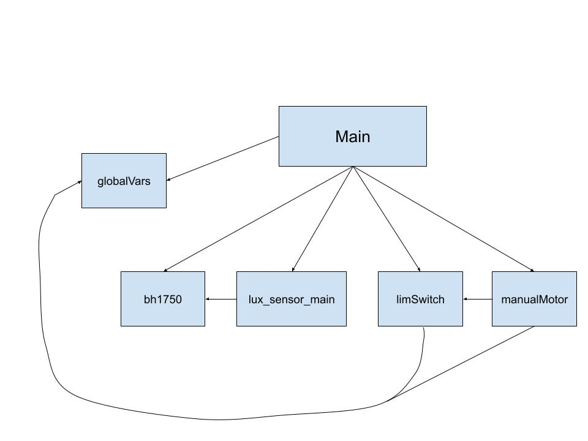
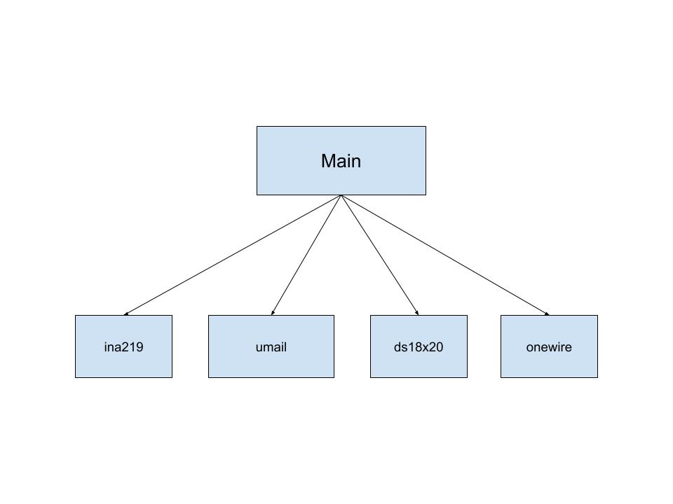
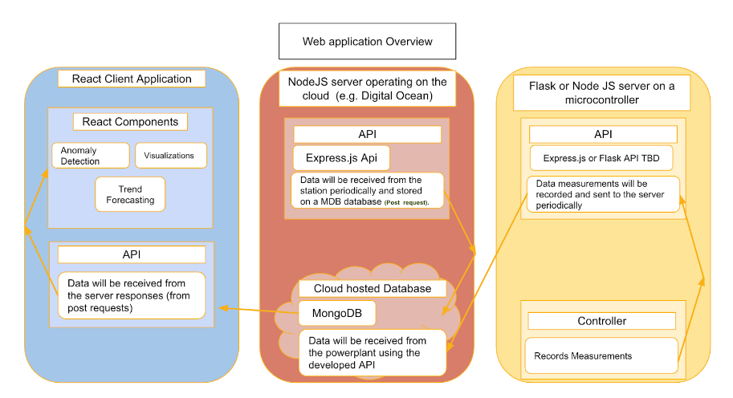

# Software Documentation

## Overview
The software consists of three parts:
1. Reflector Control System
2. Monitoring System
3. Web Application

The control system is written in MicroPython and is uploaded to the Rpi Pico W designated for controls on the PCB. The program controls the rotation of the stepper motors to move the reflectors up and down. It does so through an algorithm to find the spot at which incident light on the solar panels is optimized. The program also simultaneously sends data from the light sensors to our MongoDB database.

The monitoring system is written in MicroPython and is uploaded to the Rpi Pico W designated for monitoring on the PCB. The program uses sensors to continually monitor the current and voltage of the solar panel output, and the temperature of our system. It sends these data to our MongoDB database. Users also receive an email notification for any detected anomalies.

The web application uses a MERN stack. It takes data from our MongoDB database and displays it in a visually pleasing way on the appication. Users may create an account, log in, add solar arrays, and view trends on their solar array data.

## Reflector Control System

Above is the module flow diagram for our control system.

### main.py
The main.py program of the control system begins by initializing all components necessary. It imports all of the other modules, initializes the I2C light sensors, and initializes the GPIO pins used for the motor driver. Its defined functions are RotateMotor, findLight, posRst, and main. RotateMotor simply consists of the stepping of the motor, and checks for the swHit flag that indicates that one of the limit switches has been hit, in which case it will exit the function, or continue it if the direction of rotation is away from the limit switch hit. The findLight function is the algorithm the program uses to find the position of the reflectors to optimize the light the solar panels receive. In this algorithm, the reflectors first reads the light sensor at its current position, moves up a set amount and reads the light sensor again, and compares the two readings. It continues to move up and down in diminishing distances until it settles at a position in which the difference in light between consecutive positions no longer passes a certain threshold. The posRst function is called upon initialization and moves the reflectors down until they hit the bottom limit switch, from which it can begin tracking its position in software through steps rotated from the bottom. The control system currently does not utilize this position tracking and instead only uses limit switches to prevent over-rotation, but the position tracking may be used for analysis by a future team. The main function puts all of these other functions together and is run on startup, first connecting to WiFi, then looping through the other functions. Additionally, the entire module checks for the manualMode flag throughout the program, in which case it will enter manual control mode.

### lux_sensor_main.py
This module sends the light sensor data to the database, and is called by the main module. The function calculate_solar_irradiation converts the sensor data in lux to solar irradiation in W/m^2 and the readPower function calculate the power produced by the solar panels. The connect_to_wifi connects to WiFi with the SSID and password as parameters. The functions createOne, findOne, pushOne,and updateOne create a new "day" on the database, finds the right day, pushes data to the right dictionary, and updates data already in the database. The luxMain function does these things with regards to the light sensor readings.

### limSwitch.py
This module holds the interrupt and interrupt handler for the bottom and top limit switches. The limit switches are pulled high, normally open, and triggers the interrupt upon the falling voltage, with its com connected to ground. The handler immediately disables the motor, checks which limit switch was hit, and sets the swHit flag to the right value--1 for the bottom switch, 2 for the top switch. This flag is set back to 0 upon moving away from the limit switch in either the main module or the manualMotor module.

### globalVars.py
This module simply keeps track of the position tracking of the stepper motors, the swHit flag for the limit switches and the manualMode flag for the manual control mode. A separate module is used to make updating these variables easy across all of our modules.

### bh1750.py
This is an open source module which consists of a class for the BH1750 light sensor. This class is primarily used to initialize our light sensors and read sensor values.

## Monitoring System

Above is the module flow diagram for our monitoring system.

### main.py
The main module of the monitoring system initializes I2C for the current/voltage sensor, and initializes the temperature sensor with the use of the onewire module, since there is only one data bus for the temperature sensor (its other pins are for power and ground). The main module then has a collection of functions used for interfacing with our database, for creating, finding, and updating data fields. This also includes anomaly tracking. The main function uses these functions to continually read data from the sensors, converting the value to be sent to the database, and sending the data to the database. It also checks if the current or voltage reading is outside of a certain threshold, in which case it will send the anomaly notification email.

### umail.py
This module contains a class for an SMTP client for sending email in MicroPython (MIT license; Copyright (c) 2018 Shawwwn <shawwwn1@gmail.com>). This module is used for sending detected anomalies in our main module.

### onewire.py
This is a one-wire driver for reading data with a digital GPIO pin (MIT license; Copyright (c) 2016 Damien P. George). We use this class to initialize our temperature sensor.

### ds18x20.py
This class initializes our temperature sensor and read temperature (MIT license; Copyright (c) 2016 Damien P. George). Specifically, we use the scan, convert_temp, and read_temp functions in our main module.

### ina219.py
This module is an open source library for the current/voltage sensor. Specifically, we use the getBusVoltage_V and the getCurrent_mA functions in our main module.

## Web Application

Above is the overview diagram for our web application.

### Overview
The web application consists of a MERN stack app, which includes MongoDB, express.js, react, and node.js. It will be hosted on a cloud hosting provider like digitalOcean or Heroku. The app utilizes a cluster on the MongoDB Cloud Atlas hosting platform to store the data from the Pico W. In this manner, the microcontroller is capable of transmitting data to the database directly from any IP address, as per the configuration chosen on the web platform. The web application utilizes an express.js server for its server side. This server manages all API calls made from the front end (React) side, including get, post, put, and head requests. The express.js server establishes communication with the database housed on our cloud platform. ExpressJS, a framework derived from Node.js, is an asynchronous runtime environment that facilitates the development of network applications. The client side of the system will comprise a client application developed using the react.js framework, which is structured as HTML. The react client will interact with the express.js web server by utilizing the Axios javascript requests module to initiate requests. Subsequently, the web server will transmit data to the client to render and present it to the user.

### Installation
Please find details on how to run the web application from scratch in (./Web_App/README_WebApp.md).